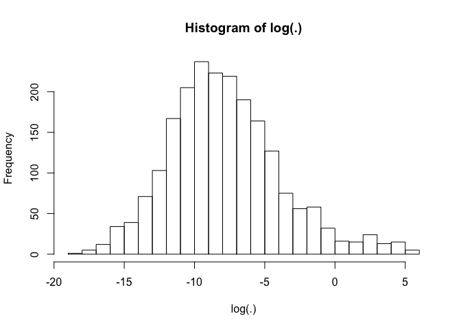
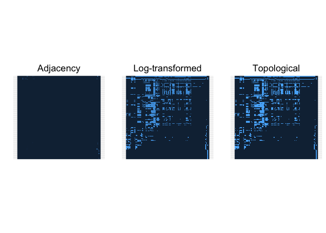
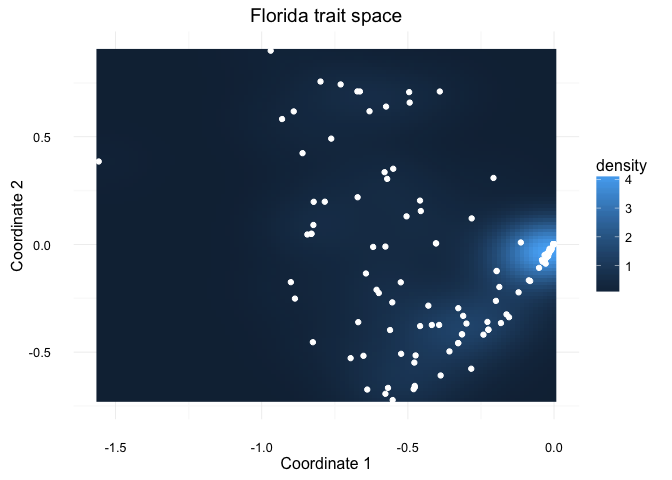
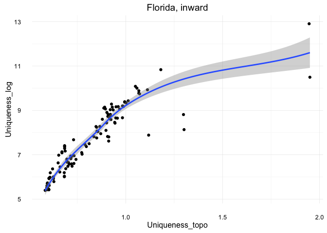
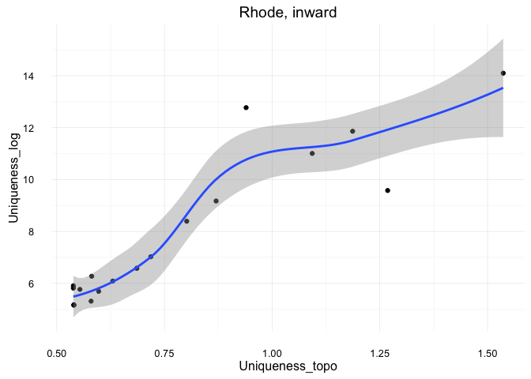
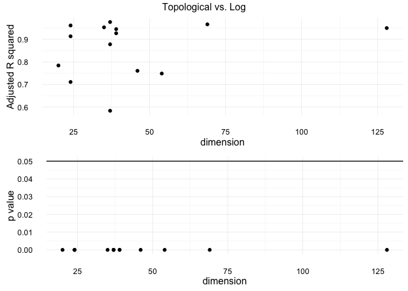
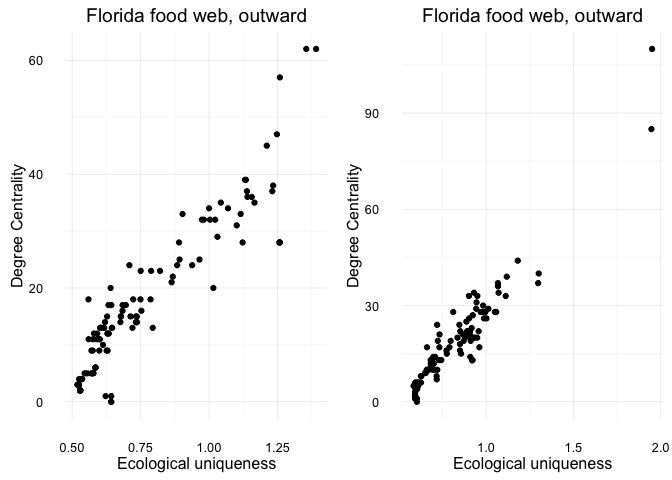
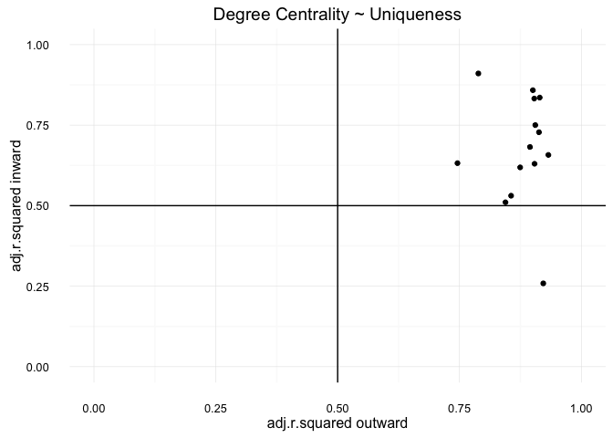

# The distribution of uniqueness and centrality in food webs
Giulio Valentino Dalla Riva  
June 27, 2016  


## Introduction

In this vignette we will see how we used one dataset of weighted ecological networks to test the hypothesis that central species in ecological networks are ecologically unique, i.e., they play unique roles in the food webs.

This data analysis is motivated by an ecological conundrum: indeed, the evidence exhibited in the literature point both in the direction and contrary to the hypothesis. There is also a more theoretical motivation, that is, exploring the possibility of analysing food webs in their low dimensional geometric representation we introduced in recent paper (Dalla Riba and Stouffer, 2016, Oikos). Finally, we also address the issue that many

### Implementation: tidy
We will operate within the tidy-verse, make extensive use of piping.


```r
library(ggplot2)
library(gridExtra)
library(reshape2)
library(stringr)
library(purrr)
library(tidyr)
library(dplyr)
library(magrittr)
```

For readingness, we will also rely on a set of functions we will not discuss directly in this vignette. The input/output functions we source from `io.R` are described in the details in another vignette, and they permit us to transform the _Pajek_ raw data to the data we use here. The ancillary functions in `ancillary.R` take charge of some minor operations, such as sourcing whole directories. All the plot functions are collected in `plot_functs.R`: they are basic layering over `ggplot2`.


```r
#the location of io.R:
source("../ancillary.R")
source("../io.R")
source("../plot_functs.R")

#the location of the R files of ecolowdgy: 
ecolowdgy.dir <- "../../../2016_Ecolowdgy/ecolowdgy/R/"

#where to save the zip archive with the raw weighted webs:
dest.file <- "../../Data/Raw/Weighted_webs.zip"

#either `FALSE` or the folder where to save the Rdata
Save.weighted.igraphs <- FALSE
```

## Data

We analyse a set of weighted food webs from http://vlado.fmf.uni-lj.si/pub/networks/data/bio/foodweb/foodweb.htm (see the website for more informations). The original data was in the _SCOR_ format (July 2002 by R.E. Ulanowicz), it has been transformed to _Pajek_ by Vladimir Batagelj in 2004. Here we further transform them to _igraph_ objects and get their weighted adjacency matrices.


```r
"http://vlado.fmf.uni-lj.si/pub/networks/data/bio/FoodWeb/Webs_paj.zip" %>%
  download.file(dest.file, mode="wb")
dest.file %>% unzip(list=TRUE) -> webs.list
webs.list
```

```
##                  Name Length                Date
## 1  paj/Chesapeake.paj   6571 2003-07-15 01:39:00
## 2   paj/ChesLower.paj   5619 2003-07-15 03:39:00
## 3  paj/ChesMiddle.paj   6255 2003-07-15 03:33:00
## 4   paj/ChesUpper.paj   6400 2003-07-15 03:29:00
## 5    paj/CrystalC.paj   3908 2003-07-15 04:11:00
## 6    paj/CrystalD.paj   3420 2003-07-15 04:16:00
## 7  paj/Everglades.paj  25286 2003-07-14 23:47:00
## 8     paj/Florida.paj  56241 2003-07-15 01:42:00
## 9  paj/Maspalomas.paj   2965 2003-07-15 01:50:00
## 10   paj/Michigan.paj   7010 2003-07-15 04:03:00
## 11    paj/Mondego.paj  11916 2003-07-14 23:59:00
## 12   paj/Narragan.paj   6753 2003-07-15 00:02:00
## 13      paj/Rhode.paj   2324 2003-07-15 03:49:00
## 14    paj/StMarks.paj  11888 2003-07-15 02:52:00
## 15               paj/      0 2003-07-15 04:24:00
```

How many? (`-1` as we do not want to count the folder itself)


```r
L <- dim(webs.list)[1] - 1
```

Obtained the name of the food webs present in the file, and having already coded a little function to transform _Pajek projects_ into `igraph` objects, we build a nested data frame with a column for the food webs' adjacency matrices. We keep them in a wide format as this allows a prompter application of our mathematical tools.


```r
w_adjs_df <- data_frame(name_web = webs.list$Name[1:L])  %>%
  mutate(
    adjacency = map(name_web, ~.x %>%
                            unz(dest.file,.) %>%
                            adjacency_from_paj %>%
                            tbl_df() )
               ) %>%
  mutate(name_web =  name_web %>%
                     str_replace_all("[\\.]?paj[\\/]?",""))
```

And, we store store it, if we want, as an `.Rdata` file for a quick retrieval.


```r
if(Save.weighted.igraphs != FALSE){
  save(w_adjs_df, file = Save.weighted.igraphs)
}
```

### What do we have in the dataset?

A quick look at our data frame already allows us to retrieve some information, such as the number of nodes in the ecological networks:


```r
w_adjs_df
```

```
## # A tibble: 14 x 2
##      name_web            adjacency
##         <chr>               <list>
## 1  Chesapeake   <tibble [39 x 39]>
## 2   ChesLower   <tibble [37 x 37]>
## 3  ChesMiddle   <tibble [37 x 37]>
## 4   ChesUpper   <tibble [37 x 37]>
## 5    CrystalC   <tibble [24 x 24]>
## 6    CrystalD   <tibble [24 x 24]>
## 7  Everglades   <tibble [69 x 69]>
## 8     Florida <tibble [128 x 128]>
## 9  Maspalomas   <tibble [24 x 24]>
## 10   Michigan   <tibble [39 x 39]>
## 11    Mondego   <tibble [46 x 46]>
## 12   Narragan   <tibble [35 x 35]>
## 13      Rhode   <tibble [20 x 20]>
## 14    StMarks   <tibble [54 x 54]>
```

### Weight distribution

Or we can look at the distribution of interaction weights in any of them:


```r
w_adjs_df %>%
  filter(name_web %in% "Florida") %>%
  select(-name_web) %>%
  unnest(adjacency) %>%
  as.matrix.data.frame() %>% # just for this quick sanity test, we don't need row names
  {hist(log(.),breaks = 20)}
```

<!-- -->

It looks rather Log-normal (and we leave normality testing for later).

## Methods

For each matrix, we compute each species' abstract traits from the weighted, the log transformed weighted and the topological adjacency matrix (see Dalla Riva & Stouffer, Oikos (2016), for more details).

We will use some of the functions in the `ecolowdgy` package (to appear). The package provides an analytical framwork for studying food webs as represented in a low dimensional geometrical space (somewhat akin to Hutchinson's _hyperdimensional cube_).

_Now is a good moment to check where the package is. I provided it here for ease of use of this vignette, soon it will be possible to download it from its github repository._


```r
list.files(ecolowdgy.dir)
```

```
##  [1] "ancillary_function.R"        "cosine.R"                   
##  [3] "elbows_get.R"                "function_pickers.R"         
##  [5] "get_strains.R"               "hello.R"                    
##  [7] "inner_functions.R"           "random_matrices.R"          
##  [9] "strain_bipartite_compute.R"  "strain_compute.R"           
## [11] "strain_symmetric_compute.R"  "strain_unipartite_compute.R"
## [13] "strainer.R"                  "traits.R"
```

```r
sourceDir(ecolowdgy.dir)
```

```
## ancillary_function.R :
## cosine.R :
## elbows_get.R :
## function_pickers.R :
## get_strains.R :
## hello.R :
## inner_functions.R :
## random_matrices.R :
## strain_bipartite_compute.R :
## strain_compute.R :
## strain_symmetric_compute.R :
## strain_unipartite_compute.R :
## strainer.R :
## traits.R :
```

### Matrix transformations

First of all we increase the data frame with the log transformed and the topological transformed versions of the adjacency matrix. While we do it we collect also some basic descriptive information about the networks, such as their dimension (the number of nodes), the number of ecological interactions they show and their connectance (the ratio between the number of nodes and the square of the number of ecological interactions).


```r
w_adjs_df %<>% mutate(
    adjacency_log = map(adjacency, ~.x %>%
                                 as.matrix() %>%
                                 {ifelse(. > 0,log(.),-100)} %>%
                                 tbl_df()),
    
    adjacency_topo = map(adjacency, ~.x %>%
                                 as.matrix() %>%
                                 {ifelse(. > 0,1,0)} %>%
                                 tbl_df()),
    
    dimension = map(adjacency_topo,
      ~.x %>% nrow()) ,
    
    n_link = map(adjacency_topo,
      ~.x %>% sum())
) %>%
  unnest(dimension,n_link) %>%
  mutate(connectance = n_link / (dimension ^ 2))
```

Let's take a look at what we have. We filter one food web, select its adjacency---either the original weighted version, the log transformed on or the topological transformation of it---, unnest it and plot it as a matrix.


```r
original <- w_adjs_df %>%
  plot_adjacency("Florida","adjacency","Adjacency")

logged <- w_adjs_df %>%
  plot_adjacency("Florida","adjacency_log","Log-transformed")

topoed <- w_adjs_df %>%
  plot_adjacency("Florida","adjacency_topo","Topological")

grid.arrange(original, logged, topoed, ncol = 3)
```

<!-- -->

Not the best represantation, we could have done something better with `ggplot` but it's enough to understand the transformation are doing what we want: indeed, the three raster images looks similar.

### Centrality measures: degree

We are all set to collect some classic centrality measures about the nodes. A basic one is the number of portion of interactions each node is involved in, either as a source of the interaction or as a sink. This measure can be measured from the topological adjacency---and the measurament value will be the count the number of interactions---or in one of the two weighted adjacency---in which case the measurement value will be weighted by the weighted of the interactions.


```r
w_adjs_df %<>% mutate(
  degree_in = map(adjacency,
                         ~.x %>% colSums()),
  degree_out = map(adjacency,
                          ~.x %>% rowSums()),
  degree_in_log = map(adjacency_log,
                         ~.x %>% colSums()),
  degree_out_log = map(adjacency_log,
                          ~.x %>% rowSums()),
  degree_in_topo = map(adjacency_topo,
                         ~.x %>% colSums()),
  degree_out_topo = map(adjacency_topo,
                          ~.x %>% rowSums())
)
```

### Network Traits

In the cited Oikos paper we introduce the concept of abstract functional traits for species in food webs. They describe the role of a species in a food web as a predator (consumer) and as a prey (resource) determining its interaction probability with the other species.

To keep the code readable, we better use a couple of ancillary functions that we will use in the `mutate`+`map` flow.


```r
traits_nest <- function(x,Rank,traits_mode) {
data.frame(node_name = colnames(x),
           rank = Rank,
           mode = traits_mode,
           trait = traits(x, Rank,
                          Partition = "uni",
                          Mode = traits_mode)
           )
}

traits_in_out <- function(x,Rank){
  bind_rows(
    traits_nest(x,Rank,"inward"),
    traits_nest(x,Rank,"outward")
  )
}
```

And compute them.


```r
Rank <- 4
w_adjs_df %<>% mutate(
    traits = map(adjacency,
                        ~.x %>% traits_in_out(Rank)
                        ),
    
    traits_log = map(adjacency_log,
                        ~.x %>% traits_in_out(Rank)
                        ),
    
    traits_topo = map(adjacency_topo,
                        ~.x %>% traits_in_out(Rank)
                        )
    )
```

What have we obtained so far:

```r
w_adjs_df
```

```
## # A tibble: 14 x 16
##      name_web            adjacency        adjacency_log
##         <chr>               <list>               <list>
## 1  Chesapeake   <tibble [39 x 39]>   <tibble [39 x 39]>
## 2   ChesLower   <tibble [37 x 37]>   <tibble [37 x 37]>
## 3  ChesMiddle   <tibble [37 x 37]>   <tibble [37 x 37]>
## 4   ChesUpper   <tibble [37 x 37]>   <tibble [37 x 37]>
## 5    CrystalC   <tibble [24 x 24]>   <tibble [24 x 24]>
## 6    CrystalD   <tibble [24 x 24]>   <tibble [24 x 24]>
## 7  Everglades   <tibble [69 x 69]>   <tibble [69 x 69]>
## 8     Florida <tibble [128 x 128]> <tibble [128 x 128]>
## 9  Maspalomas   <tibble [24 x 24]>   <tibble [24 x 24]>
## 10   Michigan   <tibble [39 x 39]>   <tibble [39 x 39]>
## 11    Mondego   <tibble [46 x 46]>   <tibble [46 x 46]>
## 12   Narragan   <tibble [35 x 35]>   <tibble [35 x 35]>
## 13      Rhode   <tibble [20 x 20]>   <tibble [20 x 20]>
## 14    StMarks   <tibble [54 x 54]>   <tibble [54 x 54]>
## # ... with 13 more variables: adjacency_topo <list>, dimension <int>,
## #   n_link <dbl>, connectance <dbl>, degree_in <list>, degree_out <list>,
## #   degree_in_log <list>, degree_out_log <list>, degree_in_topo <list>,
## #   degree_out_topo <list>, traits <list>, traits_log <list>,
## #   traits_topo <list>
```

### A quick sanity test

Let's do a sanity test and see if anything of what we produced looks familiar. Let's have a look at the first two coordinates of the inward functional traits as estimated from the Everglade's food-web topology:


```r
w_adjs_df %>%
  plot_traits("Florida","traits_topo","inward")
```

<!-- -->

### Centrality: Functional uniqueness

Finally, let's compute the functional uniqueness of the species. We define it as the average distance from one species to the rest of the community, as computed in one of the original, log-transformed or topological functional-trait space. Again, for sake of clearity, let's use an ancillary function and the `mutate`+`map` flow.


```r
get_trait_matrix <- function(traits_df,Mode){

  temp_data <- traits_df %>%
    filter(mode %in% Mode) %>%
    select(-rank,-mode)

  temp_matrix <- temp_data %>% 
    select(-node_name) %>%
    as.matrix()

  row.names(temp_matrix) <- temp_data$node_name

  return(temp_matrix)
}

get_mean_dist <- function(trait_mat){
  dist(trait_mat, upper = TRUE) %>%
  as.matrix() %>% rowMeans() %>%
  {tibble(node_name = names(.),
         MeanDist = .)} %>% return()
}

get_uniqueness_in_out <- function(traits_df){
  bind_rows(
    traits_df %>%
    get_trait_matrix("inward") %>%
    get_mean_dist %>%
    cbind(Mode = "inward",.)
    ,
    traits_df %>%
    get_trait_matrix("outward") %>%
    get_mean_dist %>%
    cbind(Mode = "outward",.)
  ) %>% return()
}
```

Now we are ready to increase the data frame.


```r
w_adjs_df %<>% mutate(
    Uniqueness = map(traits,
                        ~.x %>% get_uniqueness_in_out()
                        ),
    
    Uniqueness_log = map(traits_log,
                        ~.x %>% get_uniqueness_in_out()
                        ),
    
    Uniqueness_topo = map(traits_topo,
                        ~.x %>% get_uniqueness_in_out()
                        )
    )
```

## Results

### Exposing the centralities

Now we have all the necessary data about the nodes in the ecological networks to explore their distribution in the network and, as we do in the manuscript, their correlation with other ecological (network) indicators---such as other measures of node centrality. We use a light function to expose the desidered uniqueness values from our nested data frame.


```r
expose_uniqueness <- function(webs_df,Web_name,Transformed,Mode_uniqueness,
                              Arrange = F){
    webs_df %>%
    filter(name_web %in% Web_name) %>%
    select_(Transformed) %>%
    unnest() %>%
    filter(Mode %in% Mode_uniqueness) %>%
    select(-Mode) -> Uniqs
    if(Arrange){
      Uniqs  %>%
      arrange(-MeanDist) %>%
      return()
    } else {
      Uniqs  %>% return()
    }
}

expose_degree <- function(webs_df,Web_name,Degree_measurement,
                              Arrange = F){
    
  data_frame(node_name = webs_df %>%
                      filter(name_web %in% Web_name) %>%
                      select(adjacency) %>%
                      unnest() %>% 
                      names()
  ) %>% bind_cols(
    webs_df %>%
    filter(name_web %in% Web_name) %>%
    select_(Degree_measurement) %>%
    unnest()
  ) -> deg
  
    if(Arrange){
      deg  %>%
      arrange_(-Degree_measurement) %>%
      return()
    } else {
      deg  %>% return()
    }
}
```

### Is the topological approximation sensible?

And we give a look at a scatter plot of the uniqueness values estimated from the topological and the log-transformed adjacency matrix: how much information do we loose when we rank species just from their topological networks (without any information about the link weights)?


```r
w_adjs_df %>%
  plot_uniqs("Florida",c("Uniqueness_topo","Uniqueness_log"),"inward")
```

<!-- -->

In the rather large _Florida_ food web---128 nodes---not too much.


```r
w_adjs_df %>%
  plot_uniqs("Rhode",c("Uniqueness_topo","Uniqueness_log"),"inward")
```

<!-- -->

The correlation between topological uniqueness and log-transformed uniquess may be less significant for the much smaller _Rhode_ food web (20 nodes). Are we looking at a general trend here?
Let's gather the information from a linear mode and see if there's an increasing trend with larger webs.


```r
uniqueness_correlation <- function(webs_df,Web_name,Tran_x_y,Mode_uniqueness){
  expose_uniqueness(webs_df,Web_name,Tran_x_y[1],Mode_uniqueness) %>%
  left_join(
      expose_uniqueness(webs_df,Web_name,Tran_x_y[2],Mode_uniqueness),
      by = c("node_name")
    ) %>%
  lm(MeanDist.x ~ MeanDist.y,data = .) %>%
  broom::glance() %>%
    return()
}
```


```r
X_Y <- c("Uniqueness_topo","Uniqueness_log")
Mode_ars <- "outward"
w_adjs_df %<>%
  mutate(
    adj_r_squared_topo_log_outward = map(
      name_web,
      ~.x %>% uniqueness_correlation(w_adjs_df,.,X_Y,Mode_ars)
  )
)
```

So, does the quality of the approximation depends on the dimension of the food web?


```r
adjs_r <- w_adjs_df %>%
  unnest(adj_r_squared_topo_log_outward) %>%
  ggplot(aes(dimension,adj.r.squared)) +
  geom_point()  +
  xlab("dimension") + ylab("Adjusted R squared") +
  theme_minimal()

pval <- w_adjs_df %>%
  unnest(adj_r_squared_topo_log_outward) %>%
  ggplot(aes(dimension,p.value)) +
  geom_hline(yintercept = 0.05) +
  geom_point()  +
  xlab("dimension") + ylab("p value") +
  theme_minimal()

grid.arrange(adjs_r, pval, top = "Topological vs. Log")
```

<!-- -->

Not really, as far as we can tell. The correlation is always quite strong, no matter the dimension of the web. Maybe, afterall, we can trust the ranking we gather from the topological representations of the ecological networks.

### Are degree centrality and uniqueness correlated?

There is something more to our interest. If we look at the _Florida_ food web, and in particular at the distribution of its node degrees and uniqueness, they appear correlated: central nodes are more unique.


```r
out_p <- w_adjs_df %>%
  plot_deg_uniq("Florida",c("Uniqueness_topo","degree_out_topo"),"outward")

in_p <- w_adjs_df %>%
  plot_deg_uniq("Florida",c("Uniqueness_topo","degree_in_topo"),"inward")

grid.arrange(out_p, in_p, ncol = 2)
```

<!-- -->

This, and a lot of ecological literature, motivates us to explore the hypothesis that uniqueness and centrality are correlated. In fact, the literature points in opposing direction, with suggestive evidence of both negative and positive (as well as null) correlation. Thus, the result will be particularly interesting.


```r
centrality_correlation <- function(webs_df,Web_name,Tran_x_y,Mode_uniqueness){
  deg_name <- Tran_x_y[2] %>% as.character()
  y <- expose_uniqueness(webs_df,Web_name,Tran_x_y[1],Mode_uniqueness) %>%
    select(-node_name) %>% unlist() %>% as.numeric()
  x <- expose_degree(webs_df,Web_name,deg_name) %>%
    select(-node_name) %>% unlist() %>% as.numeric()
  lm(y ~ x) %>%
  broom::glance() %>%
   return()
}

w_adjs_df %<>%
  mutate(
    uniqueness_degree_topo_out = map(
      name_web,
      ~.x %>% centrality_correlation(w_adjs_df,.,
                                     c("Uniqueness_topo","degree_out_topo"),
                                     "outward"))
      ,
      uniqueness_degree_topo_in = map(
      name_web,
      ~.x %>% centrality_correlation(w_adjs_df,.,
                                     c("Uniqueness_topo","degree_in_topo"),
                                     "inward"))
)
```

Let us see the result of our computations. First by looking at the data frames:


```r
w_adjs_df %>%
  select(uniqueness_degree_topo_in) %>%
  unnest()
```

```
## # A tibble: 14 x 11
##    r.squared adj.r.squared      sigma  statistic      p.value    df
##        <dbl>         <dbl>      <dbl>      <dbl>        <dbl> <int>
## 1  0.8777448     0.8744406 0.11066862  265.64560 1.803554e-18     2
## 2  0.8975046     0.8945762 0.09039932  306.47878 6.859314e-19     2
## 3  0.9154699     0.9130547 0.07356134  379.05362 2.331338e-20     2
## 4  0.8598469     0.8558426 0.09375518  214.72698 1.672034e-16     2
## 5  0.7568604     0.7458086 0.13919273   68.48301 3.350067e-08     2
## 6  0.9081420     0.9039666 0.08581706  217.50006 6.905462e-13     2
## 7  0.9333090     0.9323136 0.06550328  937.63290 4.055823e-41     2
## 8  0.9013127     0.9005294 0.07068066 1150.75947 3.247555e-65     2
## 9  0.9252540     0.9218565 0.06741369  272.33020 7.090558e-14     2
## 10 0.9168624     0.9146155 0.07356781  408.04559 1.409280e-21     2
## 11 0.8477518     0.8442916 0.11115076  245.00184 1.343005e-19     2
## 12 0.9082896     0.9055105 0.08320607  326.82815 1.093823e-18     2
## 13 0.7997882     0.7886654 0.13358710   71.90481 1.059015e-07     2
## 14 0.9051975     0.9033744 0.07836157  496.50899 2.883698e-28     2
## # ... with 5 more variables: logLik <dbl>, AIC <dbl>, BIC <dbl>,
## #   deviance <dbl>, df.residual <int>
```

```r
w_adjs_df %>%
  select(uniqueness_degree_topo_out) %>%
  unnest()
```

```
## # A tibble: 14 x 11
##    r.squared adj.r.squared      sigma  statistic      p.value    df
##        <dbl>         <dbl>      <dbl>      <dbl>        <dbl> <int>
## 1  0.6288604     0.6188296 0.15247065  62.692951 1.760821e-09     2
## 2  0.6910637     0.6822369 0.12270537  78.291948 1.882118e-10     2
## 3  0.7355225     0.7279660 0.11114389  97.336394 1.205539e-11     2
## 4  0.5438965     0.5308650 0.14766008  41.736966 1.919952e-07     2
## 5  0.6480019     0.6320020 0.13730977  40.500335 2.101764e-06     2
## 6  0.6461375     0.6300529 0.20101679  40.171047 2.230345e-06     2
## 7  0.6625358     0.6574990 0.13958842 131.539557 1.858475e-17     2
## 8  0.8596409     0.8585269 0.09138780 771.697166 1.443264e-55     2
## 9  0.2908684     0.2586352 0.22736921   9.023862 6.534148e-03     2
## 10 0.8399488     0.8356231 0.10794199 194.176086 2.688245e-16     2
## 11 0.5212945     0.5104148 0.16501845  47.914541 1.487370e-08     2
## 12 0.7575343     0.7501869 0.13787665 103.101741 1.102889e-11     2
## 13 0.9152074     0.9104967 0.08133956 194.282751 4.372643e-11     2
## 14 0.8357515     0.8325929 0.12313338 264.593456 4.811512e-22     2
## # ... with 5 more variables: logLik <dbl>, AIC <dbl>, BIC <dbl>,
## #   deviance <dbl>, df.residual <int>
```

And then by looking at them graphically.


```r
w_adjs_df %>%
  plot_summary_stat(c("uniqueness_degree_topo_in","uniqueness_degree_topo_out"),
                    "adj.r.squared")
```

<!-- -->

Finally, we can conclude that in our dataset the degree centrality of nodes in an ecological network a predictor of their ecological uniqueness.
