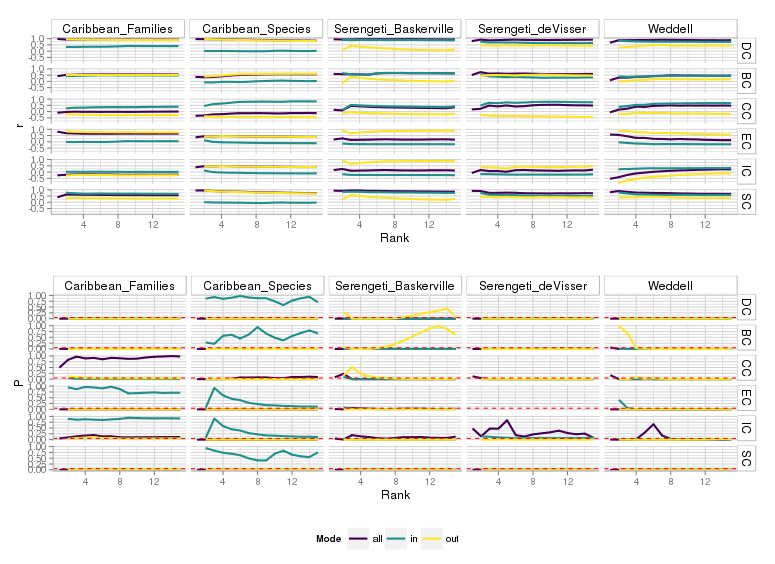

---
title: "Supplementary Material for *Important, Unique, Central: Species' Relevance in Food Webs*"
author:
- name: Giulio Valentino Dalla Riva
  affiliation: University of Canterbury, New Zealand
  email: gvd16@uclive.ac.nz
- name: Carey E. Priebe
  affiliation: John Hopkins University, MD, USA
date: February 2016
...

# Supplementary Methods

## The Random Dot Product Graph model: context and details

In our paper we introduce the Random Dot Product Graph model (RDPG) for food
webs.  This model can be seen as a special case of the stochastic block graph
model, originally developed for the analysis of undirected social networks
[@holland1983stochastic] and subsequently generalised to directed graphs
[@wang1987stochastic]. Under the stochastic blockmodel assumptions, each of the
nodes of a network are assigned to one of $K$ distinct blocks. The probability
of a link within and between the $K$ blocks are given by the model parameters.
However, in practice we do not observe the assignment of the nodes to the
blocks; rather, we observe the interactions between nodes and try to estimate
the assignment. This approach has been by some recent models for food webs
[@allesina2009food, baskerville2011spatial].  Recently, it has been proved that
a consistent block estimator (i.e., an estimator such that the proportion of
nodes assigned to the wrong group converges in probability to zero as the
number of the species grows to infinity) based on the spectral partitioning of
the normalized Laplacian of the adjacency matrix exist [@rohe2011spectral]. The
RDPG model can be read as a particular case of the stochastic blockmodels
[@fishkind2013consistent] where each species is assigned to different block and
the probability of the interaction from block (species) $i$ to block (species)
$j$ depends on the distance between $i$ and $j$ in the metric space, i.e., it
is given by the dot product of the two position vectors.  We observe the
realized interactions and estimate the position of the species in the metric
space.  Notice that, as the interaction probabilities are given by the pairwise
distances, and the observed graph is an outcome of a stochastic process defined
by those probabilities, any transformation of the metric space preserving the
distance structure begets an equivalent model.

In particular, the RDPG model we consider in the paper is a generalization of
the RDPG model to binary directed graphs: as the interactions are no more
symmetric, we have to consider a pair of metric spaces, an *inward* and an
*outward* one. We use an estimator based on the spectral partitioning of
adjacency (non Laplacian) matrix of a graph [@sussman2012consistent] to estimate species
positions in the underlying metric space.

With some abuse of notation, we let $A$ denote both a food web and its adjacency matrix.
Let the three matrices $L, \Sigma, R$ denote a singular value decomposition of the adjacency
matrix $A$ (a food web with $S$ species).
Thus, the matrices $L, \Sigma, R$ satisfy $A = L \times \Sigma \times R^t$;  $L$ and
$R$ are real, orthogonal $S \times S$ matrices; $\Sigma$ is an $S \times S$
diagonal matrix whose entries are the singular values of $A$, in a
non-decreasing order. Fixed a model dimension $d$, we define three new
matrices:

1.  $L'$, an $S \times d$ matrix given by the first $d$ columns of $L$;
2.  $R'$, an $S \times d$ matrix given by the first $d$ columns of $R$;
3.  $\left(\Sigma'\right)^{1/2}$, an $d \times d$ diagonal matrix defined by the
square root of the first $d$ entries of $\Sigma$, i.e., the square root of the
first $d$ greatest singular values of $A$.

Then, we let $\hat{L}$ denote the rescaled matrix $L' \times \left( \Sigma'\right)^{1/2}$
and we let $\hat{R}$ denote the rescaled matrix $\left( \Sigma'\right)^{1/2} \times R'$.
The two matrices $\hat{l}$ and $\hat{R}$ capture the $d$ leading traits for the community of species
as prey and predators: the rows of $\hat{L}$ define the species'
vulnerability functional traits (*outward*) and the rows of $\hat{R}$ define the foraging
functional traits (*inward*) of the species in $A$. We call the column binding of $\hat{L}$ and
$\hat{R}$ the species functional traits as both prey and predators (*total*).

Notice that although $\hat{L}$ and $\hat{R}$ are not uniquely defined, as any orthogonal transformation of those
matrices preserve their dot product (and hence the distance between the estimated
stochastic food web's backbone and its observed adjacency matrix), the species' relative
position and the induced pairwise distance structure in the abstract functional space are
uniquely defined. The measures we introduce in the paper are based on the invariant
structure of the food web, rather then on the absolute position of the species.

Different approaches are available for the choice of a suitable dimension $d$
range. This akin to a dimensionality reduction problem, discussed for the Principal
Component Analysis scenario in [@jolliffe2002principal].  The available methods
include \emph{a priori} selection procedures (e.g., the visual analysis of the singular
values scree plot [@cattell1966scree], hard singular values thresholding
[@chatterjee2014matrix,@gavish2014optimal] or the maximization of a profile likelihood function
[@zhu2006automatic]) and \emph{a posteriori} maximization of a
goodness-of-fit criterion, as we exampled in [@dallariva2015exploring]. In the datasets
analysed all the previous methods provided compatible results.

### The RDPG based measures

Let $X(A)$ denote the matrix of (outward, inward or total) functional traits of the species
in the food web $A$. As we saw above, the pairwise distance structure induced by $X(A)$
is uniquely defined, and hence it is possible to investigate the distribution of the
species in the functional traits space just estimated. In particular, we define
the (outward, inward or total) *uniqueness* of a species $i$ in the food web $A$ as the mean distance between
$i$ and every other species $j$ in the (outward, inward or total) functional traits space.
Let $d\left(p,q\right)$ denote the $d$ dimensional euclidean distance between the
point $p$ and $q$; let $\langle f(i,j) \rangle_j$ be the mean of the function $f$ over
all the species $j$ except $i$. That is, $\langle f(i,j) \rangle_j = \frac{1}{S}\sum_{j \neq i}(f(i,j))$. Then,
the **uniqueness** of species $i$ is defined as:

\begin{equation}
\mbox{uniqueness($i$)} := \langle d\left( X(A)_i,X(A)_j\right)\rangle_j
\end{equation}

Let $M$ denote a $N \times M$ matrix: we denote $M^{d(i)}$  the matrix obtained by dropping
the $i$-th column and row from $M$; te denote $M^{r(i)}$ the matrix obtained by
removing just the $i$-th row from $M$. Let $W$ denote another $N \times M$ matrix.
We define $M_{proc}(W)$ as the Procrustes transformation (i.e., a combination of translation,
rotation and uniform rescaling) of $M$ of minimal distance to $W$; we will drop the argument $(W)$
from the notation whenever it is clear from the context.
Finally, we denote $||M||_F$ the squared sum of entries of $M$, i.e., the
Frobenius norm of the matrix $M$ . In particular, $||M_{proc}(W) - W||_F$
is also called the Procrustes distance between $M$ and $W$ [@dryden1998statistical].

We compute the  matrix
$$\bigg[X\left(A^{d(i)}\right)\bigg]_{proc}\bigg(X\left(A\right)^{r(i)}\bigg) \, ,$$
that is, the Procrustes transformation of $X\left(A^{d(i)}\right)$ of minimal distance to
$X(A)^{r(i)}$ and we denote it $\hat{X}\left(A^{d(i)}\right)$.
We define the rank $d$ **strain** of the species $i$ as the sum of squared entries of the
differences between $X(A)^{r(i)}$ and $\hat{X}\left(A^{d(i)}\right)$. Being $X(A)$ the matrix of
either the inward, outward or total $d$ dimensional functional traits, we will speak of
species' \emph{inward},  \emph{outward} or  \emph{total} strain, respectively.
In formula:

\begin{equation}
\mbox{strain($i$)} := ||X(A)^{r(i)} - \hat{X}\left(A^{d(i)}\right)||_F
\end{equation}

Computing the strain of species $i$ reduces to computing the ordinary
Procrustes distance between the matrices $X(A)^{r(i)}$ and
$X\left(A^{d(i)}\right)$, which is implemented by the *procOPA* function in the
R package \emph{shapes} [@shapes,@R].

Finally, we identify the (outward, inward, total) diversity of the food web $A$
as the volume of the convex hull containing all the species in the (outward,
inward, total) functional traits space. Conceptually borrowing from the
functional traits literature, we define the **contribution** of the species $i$
to the food web (outward, inward, total) **functional diversity** as the volume difference of the
convex hulls of $X\left(A\right)$ and $X\left(A\right)^{r(i)}$. We compute the
convex hulls and their volumes using Qhull [@barber1996quickhull], through the
\emph{R} package \emph{geometry} [@geometry].

### Keystone Centralities

We compare our novel measures with six graph centralities measures that have
been adopted to idenfity keystone species in ecological networks. In
particular, for each species $i$ in the food web, we consider:

-  the betweennessi [BC, @freeman1977set] of species $i$, given by the number $s_{jij'}$ of shortest paths connecting
   every pair $j,j'$ of species in the food web traversing species $i$i, weighted by
   the total number $s_{jj'}$ of paths between $j$ and $j'$:
   $$BC(i) := \frac{s_{jij'}}{s_{jj'}}$$
-  the closeness [CC, @bavelas1950communication] of species $i$, defined as the reciprocal of the sum of the path
   distances, $d_p(\cdot)$, from $i$ to every other species $j$ in the food web:
   $$CC(i) := \left( \sum_{j \neq i} d_p(j,i)\right)^{-1}$$
-  the degree (DC) of species $i$, measuring the number of interactions involving
   the species $i$ (both as a predator or as a prey):
   $$DC(i) := |\left\{j \in A | i \to j \mbox{ or } j \to i \right\}|$$
-  the eigenvector centrality [EC, @bonacich1987power] of species $i$, that is a graph centrality
   satisfying the request that the score of each species $i$ in the food web is
   proportional to the sum of the centrality scores of the species interacting with
   $i$. The values of EC are computed as the entries of the first eigenvector of $A$.
-  the information centrality [IC, @stephenson1989rethinking] of species $i$, that is the harmonic mean of
   the resistance distances [@klein1993resistance] toward the species $i$. Let $I_{ji}$ denote
   the resistance distance from $j$ to $i$, then:
   $$IC(i) := \frac{S}{\sum_{j \neq i}\left(I_{ji}\right)^{-1}}$$
-  the subgraph centrality [SC, @estrada2005subgraph] of species $i$, which counts the number of returning loops
   starting from species $i$, discounted exponentially by their size. It is possible to give
   a closed expression for IC in terms of the exponential of the adjacency matrix $A$:
   $$SC(i) := \left[ e^A \right]_{ii}$$

The above centralities can be computed directly from the adjacency matrix
of the considered food web and are implemented in the \emph{R} package
\emph{igraph} [@igraph]. For a discussion of the interpretation
of the previous graph centralities in an ecological network context, see
[@jordan2009keystone,@jordan2009trophic].

\newpage

#Data

We analysed five different food webs. We present them graphically using the $x$
axis to show the species' omnivory index (adding some noise to avoid nodes
overlap), the $y$ axis to show the species trophic level, the size of the
nodes to shows species total degree and the color of the nodes their ranking
based on the total strain (deep blue for lower values, light yellow for higher values).

The original images and the interaction data are available online at the webpage
of the paper.

\newpage

##Caribbean Sea food web
We analyse the Caribbean sea food web as compiled by [@caribbean].
To observe how our model responds to leveld of taxonomic definitions, we consider both the original food web, where taxa are defined to the level
of species, and a coarser version where we cluster species into families.

\newpage

##Serengeti (Baskerville) food web

The Serengeti National Park food web was compiled by [@baskerville], notice the increased definition of the plant
guilds with respect to [@deVisser]. The higher degree of omnivory in this web is only apparent and is due to the normalisation effect.

\newpage

##Serengeti (de Visser) food web

The Serengeti National Park food web by [@deVisser]

\newpage

##Weddell Sea food web

The Weddell Sea food web is a large marine food web compiled by [@Weddell]

\newpage

#Results

##Weighted networks##

In the manuscript we presented species strain from binary
food webs' data only. In fact, obtaining estimates for the amount of energy flowing between a pair
of species is often difficult. Therefore, we usually have a more reliable knowledge of the topological structure
of an interaction network rather than of its weighted version. However, the components of the species'
diets are not equally important. Thus, if the species' ranking we estimated from the topological data
were extremely sensitive to the interactions' weight its applicability would be limited. On the other hand,
if the topological species' ranking were not affected at all by the specification of interactions weights,
that would rise doubt about its ecological meaning.

To test the extent to which our *strain* and *mean distance* measures are robust to the specification
of interactions' weights, we compared the ranking of the species based on topological data with the rankings
we obtained by simulating interactions weights. To do so, we sampled the interactions weights from a Log-Normal
distribution, truncated so that their minimum value was $10^{-6}$ and normalised so that the maximum value
was $1$.

The results we obtained show that the correlation between the topological and the weighted rankings were
significant and positive for more than $95\%$ of the simulations. However, the amount of variation in the weighted
ranking explained by the topological ranking had a large variance (i.e., it spanned the range from almost null
to almost one). Yet, the set of species with higher *strain* and the set of species with higher *mean distance*
as estimated from the topological data was consistent across the simulated weighted networks, indicating
that our measures are able to identigy the species with distinctively high ecological importance. Here we just
show part of the results (restricted to the total functional trait space and the the Baskerville's Serengeti and the
Weddell sea food webs), to support the notion that the four species with highest strain and uniqueness as computed
from the binary webs are consistently in the set of four species with highest strain and uniqueness as computed
from weighted webs.

\newpage

Frequency of presence in the set of four species with the highest strain as estimated by the simulated
weighted networks for the four species with the highest strain as estimated by the topological networks.

\newpage

Frequency of presence in the set of four species with the highest mean distance as estimated by the simulated
weighted networks for the four species with the highest mean distance as estimated by the topological networks.

\newpage

We present here additional results similar to the ones presented in the main paper.
All the original graphic files, the source code used to produce them, and the data
on which they are based are available online at http://gvdr.github.io.

\newpage

##Strain

We computed the (inward, outward and total) species strain for all the species in the five
food webs.

\newpage

##Strain distribution

We show here the distribution of the 3-dimensional total, inward and outward strain for
the five foodwebs.

\newpage

##Strain correlation

The choice of the model dimension does not substantially affect the ranking of
species' strain, supporting the notion that the measure is robust to model
parameters. Deep blue for lower coefficients of determination, light yellow for
higher values. All correlations are significant.

\newpage

##Uniqueness correlation

The choice of the model dimension does not substantially affect the ranking of
species' uniqueness, supporting the notion that the measure is robust to model
parameters. The rows show inward uniqueness, outward uniqueness and total
uniqueness respectively. Deep blue for lower coefficients of determination,
light yellow for higher values. Blank cells represent non significant
correlations.

\newpage

##Strain vs. Uniqueness

There's a significant correlation between species' strain (inward, outward or
total) and uniqueness (inward, outward or total). The correlation does not grow
with the model dimension (and for the Caribbean Sea food web (species level),
the Serengeti de Visser food web and the Weddell Sea food web it decreases).

\newpage

##Strain vs. Keystone centralities

There's a significant correlation between species' strain (inward, outward or
total) and the six centrality measures we considered. We observe more often
significant correlations at the lower model dimensions and the coefficients of
determination do not grow with model dimensions.  This suggest the conclusion
the the food web are inherently low dimensional.

\newpage

##Uniqueness vs. Keystone centralities

As for the species' strain, there's a significant correlation between species'
uniqueness (inward, outward or total) and the six centrality measures we
considered. We observe more often significant correlations at the lower model
dimensions and the coefficients of determination do not grow with model
dimensions.

\newpage

#Bibliography

